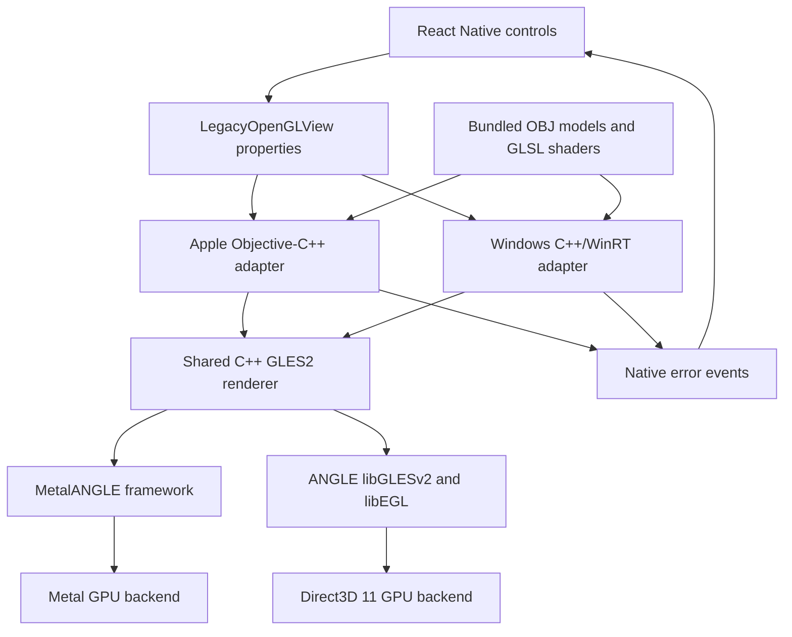
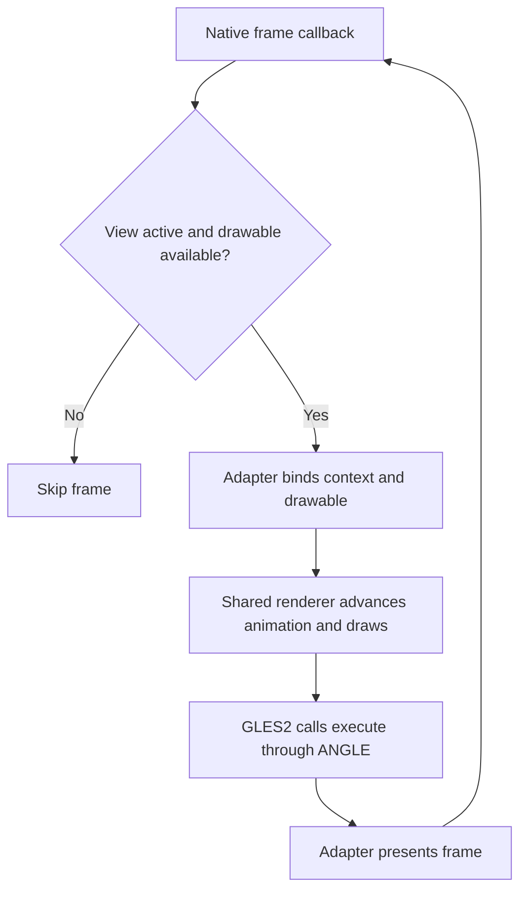
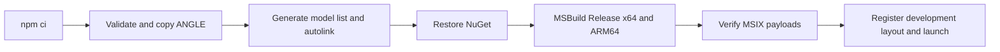
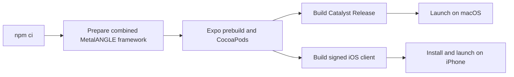

# React OpenGL Lab

React Native controls over a shared C++ OpenGL ES 2 renderer, running on Windows UWP, macOS through Mac Catalyst, and iOS. Windows uses ANGLE with Direct3D 11; Apple platforms use the supplied MetalANGLE framework with Metal.

This README is the official project documentation. It covers project structure, native integration, build workflows and verification. Historical implementation notes are available in Git history.

## Features

- Search, select or randomly choose one of ten bundled OBJ models.
- Change diffuse color, toggle rotation and wireframe, and run or reset flight animation.
- Render and animate through native frame callbacks independently of JavaScript.
- Display native rendering errors in the React interface.
- Run Release builds with bundled JavaScript without Metro.

## Architecture

React owns the controls and application state. Platform adapters own native views, graphics contexts, resource loading, frame scheduling and presentation. Both adapters compile the same `viewer::Renderer` implementation and link the GLES runtime for their platform.



The shared renderer handles OBJ parsing, mesh normalization, triangle and edge buffers, shader programs, lighting, matrix math and animation. It uses an orthographic camera and column-major OpenGL matrices. Elapsed time is clamped to 0 through 0.05 seconds.

The supported assets use OBJ positions and face indices, including negative relative indices. Polygons are fan-triangulated and flat face normals are calculated. MTL materials, textures and authored smooth normals are not loaded. Wireframe uses explicit edge lines.

The native component exposes `model`, `meshColor`, `spinning`, `flying`, `wireframe`, `resetToken` and `onError`. The project uses React Native's legacy Paper architecture with `newArchEnabled: false`.

### Frame workflow



On Apple, `CADisplayLink` schedules frames and `MGLKView` owns its framebuffer, depth/MSAA configuration and presentation. On Windows, `CompositionTarget.Rendering` schedules frames, EGL targets a `SwapChainPanel`, and the adapter presents with `eglSwapBuffers`.

All renderer GLES calls require the owning context to be current. The renderer preserves the host framebuffer and does not present. Call `releaseResources()` with a valid current context, or `abandonResources()` when the context cannot be bound. The destructor releases CPU ownership only. Recreate shaders and mesh buffers after context recreation.

## Project structure

| Path | Responsibility |
| --- | --- |
| `src/App.tsx` | Shared React controls and UI state |
| `src/OpenGLView.tsx` | Native component wrapper and error events |
| `src/generated/modelNames.json` | Generated OBJ filename list |
| `shared/renderer/ViewerRenderer.hpp` and `.cpp` | Shared renderer interface and implementation |
| `shared/renderer/ViewerMath.hpp` | Platform-independent vector and matrix math |
| `shared/resources/models/` | Ten original OBJ models and MTL companions |
| `shared/resources/shaders/` | Original vertex-lighting shaders |
| `apple_platform/LegacyOpenGLView.hpp` and `.mm` | Apple view, context, assets and frame lifecycle |
| `apple_platform/LegacyOpenGLViewManager.mm` | Apple React module and property registration |
| `apple_platform/ViewerMetalANGLE.podspec` | Local MetalANGLE framework integration |
| `microsoft_platform/OpenGLLab/AngleViewManager.cpp` | Windows React view, EGL surface and lifecycle |
| `microsoft_platform/OpenGLLab.sln` | Windows Visual Studio solution |
| `plugins/with-native-opengl.js` | Reproducible Apple source, resource and pod registration |
| `scripts/` | Artifact preparation, builds, launch and verification |
| `tests/ViewerRendererSmoke.cpp` | Shared renderer smoke-test host |
| `artifacts/` | Ignored build products, packages and logs |

Apple's `ios/` project is generated and ignored. Keep durable native changes in `apple_platform/` and the Expo plugin. Windows uses the checked-in Visual Studio/MSBuild project. `react-native.config.js` points Windows CLI discovery to `microsoft_platform/`.

Handwritten C++ and Objective-C++ headers use `.hpp`; implementations use `.cpp` or `.mm`. Generated and third-party headers retain their original names. Windows uses `pch.hpp` and generates compatibility forwarding headers for fixed `.h` includes. The shared renderer opts out of the Windows precompiled header. Format edited native sources with the root `.clang-format` configuration.

## Prerequisites

| Target | Requirements |
| --- | --- |
| All | Node.js 22 recommended by `.nvmrc`, npm and the lockfile dependencies |
| Windows UWP | Visual Studio with C++ UWP tools for x64 and ARM64, Windows SDK, and the ANGLE UWP package |
| Mac Catalyst | macOS, Xcode, CocoaPods and the combined MetalANGLE XCFramework |
| iOS device | Apple prerequisites plus a signing team, connected trusted device and Developer Mode |

The declared stack is React 19.1.0, React Native 0.81.5, React Native Windows 0.81.4 and Expo SDK 54. Keep RNW pinned while this project targets legacy Paper/UWP. Apple targets require iOS 15.1 or newer; the recorded Catalyst executable minimum is also 15.1.

Install dependencies from the repository root:

```sh
npm ci
```

Installation generates the model filename list. Geometry remains native; JavaScript does not convert meshes. ANGLE binaries are supplied separately and copied into ignored local directories.

## Windows UWP

### Prepare and build

The build script defaults to Visual Studio Community 2026, toolset `v145` and Windows SDK `10.0.26100.0`. Its default ANGLE package is `C:\Users\ASUS\source\repos\angle\artifacts\angle-uwp-release`. Override these paths for another installation:

```powershell
.\scripts\build-uwp-release.ps1 -AnglePackage 'C:\path\to\angle-uwp-release'
```

Use `-MSBuild`, `-Toolset` and `-SDK` to override the toolchain. To prepare the ANGLE dependency separately:

```powershell
.\scripts\prepare-angle-uwp.ps1 -Package 'C:\path\to\angle-uwp-release'
```

Preparation validates the SHA-256 inventory and copies the package to `third_party/angle-uwp/`. Keep its headers, libraries and DLLs from the same build. `ANGLE.UWP.props` supplies includes, import libraries and packaged `libEGL.dll`, `libGLESv2.dll` and `d3dcompiler_47.dll`.

Build both Release architectures using the default installation:

```powershell
.\scripts\build-uwp-release.ps1
```

Alternatively, open `microsoft_platform/OpenGLLab.sln` in Visual Studio. Its supported configurations are Release x64 and Release ARM64. The script restores NuGet, runs model generation and Windows autolinking, bundles JavaScript, builds each architecture and verifies the actual MSIX payload.



The Windows entrypoint is `index.windows.js`; bundling uses `metro.windows.config.js`. `ReactPackageProvider.cpp` registers the ANGLE view manager. Preserve `AutolinkedNativeModules.*` and React package registration for community modules. The XAML files provide the React host shell.

### Launch and packages

Enable Windows Developer Mode, then run the matching architecture:

```powershell
.\scripts\run-uwp.ps1 -Architecture x64
```

For a fresh bundle, native property and frame-presentation check, close the viewer first:

```powershell
.\scripts\run-uwp.ps1 -Architecture x64 -VerifyRendering
```

The run script unpacks and registers an unsigned development layout. Keep `artifacts/deploy/` while that registration is installed. Run ARM64 packages on an ARM64 device. If a framework dependency is missing, install the matching VCLibs package from the package's Dependencies directory.

| Output | Location |
| --- | --- |
| MSIX packages and dependencies | `artifacts/packages/<architecture>/` |
| Native build output | `artifacts/uwp/<architecture>/OpenGLLab/` |
| Build and binary logs | `artifacts/logs/` |
| Runtime diagnostics | `%LOCALAPPDATA%/Packages/<package-family>/LocalState/renderer.log` |

Packages are unsigned by default. To build a signed MSIX, use a certificate in the current user's certificate store whose subject matches the manifest publisher, currently `CN=ASUS`:

```powershell
.\scripts\build-uwp-release.ps1 -CertificateThumbprint YOUR_THUMBPRINT
```

The installation device must trust the certificate and have matching framework dependencies. Configure your reserved identity and publisher before Store distribution. The Windows minimum version is `10.0.17763.0`.

## macOS and iOS

### Prepare MetalANGLE

Use the supplied MetalANGLE fork's combined `out/darwin-es3-metal/MetalANGLE.xcframework`, containing iOS device, simulator and Mac Catalyst variants. The default source checkout is `../angle`:

```sh
npm run angle:prepare
npm run angle:configure
```

To use another checkout:

```sh
npm run angle:prepare -- /path/to/angle
npm run angle:configure
```

Preparation checks platform metadata and validates a supplied SHA-256 manifest when present, then copies the framework and available license/handoff files to `apple_platform/vendor/`. In the ANGLE checkout, build the iOS artifact first and then run `bash scripts/local/build-darwin-es3-metal-catalyst.sh` to create the combined package. Rebuilding only iOS replaces it with an iOS-only package.

Configuration regenerates the Expo Xcode project and explicitly installs CocoaPods. Run it after replacing the framework or changing native integration. The local pod embeds the framework; the plugin registers Apple and shared C++ sources, bundles models/shaders and enables Catalyst. Keep local signing settings in Xcode.



### Mac Catalyst

```sh
npm run build:catalyst
npm run catalyst
```

The script builds Release for the host architecture with signing disabled for local use. The app bundles JavaScript and runs without Metro. Its output is `artifacts/catalyst/DerivedData/Build/Products/Release-maccatalyst/ReactOpenGLLab.app`.

To build both Apple Silicon and Intel slices:

```sh
npm run build:catalyst -- 'ARCHS=arm64 x86_64'
```

For distribution, configure Apple signing and entitlements in Xcode and use the Mac Catalyst destination. The local script does not create a distribution archive.

### iOS device

```sh
npm run ios:device
```

Select the connected phone and signing team. Unlock and trust the Mac, enable device Developer Mode and trust the development profile if required. For an installation with bundled JavaScript:

```sh
npm run ios:device -- --configuration Release
```

For later JavaScript changes in the development client:

```sh
npm start -- --dev-client
```

Native source, shaders, bundled models and plugin changes require a native rebuild. Expo Go cannot load the custom view. `npm run build:ios` builds the simulator client; `npm run ios` starts the development client in a simulator. Android and web do not implement this graphics view.

## Verification

Check TypeScript and the Apple JavaScript bundle:

```sh
npm run check
npm run export:ios
```

Inspect Windows packages and exercise the production shared renderer:

```powershell
.\scripts\verify-uwp-package.ps1 -Architecture x64
.\scripts\verify-uwp-package.ps1 -Architecture ARM64
.\scripts\test-shared-renderer.ps1
```

The Windows smoke test requires the prepared x64 ANGLE package, Visual Studio C++ tools and installed x64 `Microsoft.VCLibs.140.00`. On Mac, run:

```sh
bash scripts/test-shared-renderer-mac.sh
```

The smoke tests compile the production renderer and check pixel readback for all ten models, wireframe, animation/reset, malformed input, negative indices and resource/context recreation. They use pbuffer surfaces and complement application testing.

For application validation, inspect the actual window, backend and first-frame logs. Exercise model selection, color, rotation, flight/reset, wireframe, resizing, view removal/reattachment and background/foreground transitions. Windows logs React startup, property delivery, backend, readback and presentation. Apple logs backend, model vertex counts, drawable dimensions and GL errors.

### Recorded validation

The following summarizes the existing project records; this documentation cleanup does not rerun native builds or device tests.

| Target | Recorded evidence | Remaining limits |
| --- | --- | --- |
| Windows x64 | Release build/package checks and fresh UWP launch passed; React bundle and properties reached C++; D3D11 ANGLE rendered with `GL_NO_ERROR` and non-background readback; shared renderer smoke test passed | Suspension and physical device-loss recovery were not fault-injected |
| Windows ARM64 | Release build and package checks passed | Device rendering remains unverified |
| Mac Catalyst | October 7, 2026 refactor build passed for arm64/x86_64; Apple M2 launch reported Metal, GLES2, cone with 186 vertices and a 1163 by 613 first frame with GL error `0x0`; shared renderer smoke test passed | Visual/control and lifecycle checks were not independently completed; Intel runtime remains unverified |
| iOS | Earlier MetalANGLE device rendering was confirmed; a later shared-renderer Release build and installation passed | Later launch was blocked by the lock screen; the final GLES2/platform refactor has no fresh iOS native build/runtime verification |

Windows evidence is under `artifacts/logs/`. The latest recorded Mac refactor logs are `artifacts/catalyst/build-refactor.log`, `runtime-refactor.log` and `smoke-refactor.log`. Logs are local ignored artifacts and may be absent in another checkout. Build success, JavaScript export and pbuffer readback establish different checks; they do not establish every application lifecycle behavior or GLES conformance.

## Resource provenance

The project adapts James Long's original React Native controls-over-OpenGL experiment. Original OBJ/MTL files and vertex-lighting shaders were relocated from the obsolete Rend example into `shared/resources/`; shader author attribution and license comments remain intact. The old source and original README are available in Git history, including commit `6ac8b4c`.

Both platform builds bundle the ten OBJ files and two lighting shaders by their original names. Check inherited asset/shader licensing and the supplied ANGLE license and handoff requirements before distributing binaries. The obsolete Rend engine and prerelease ReactKit project are historical sources, rather than current build targets.
