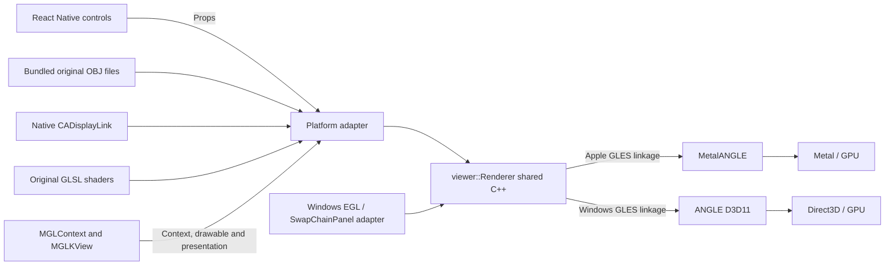

# React Native UI over a native OpenGL ES scene

## Original concept

The historical source names below refer to Git history (for example, commit `6ac8b4c`); their obsolete directories were removed from the current checkout. Original OBJ models and the reused shaders remain in `native/resources/`.

The [2015 article](https://archive.jlongster.com/First-Impressions-using-React-Native) uses React Native controls over an Objective-C OpenGL viewer. React renders the controls, not the graphics scene.

| Historical file | Responsibility |
| --- | --- |
| `TeapotAppDelegate.m` | OpenGL ES context, transparent RCTRootView over the graphics view, old bridge module lookup |
| `GLViewController.m` | REGLView, orthographic camera, Rend scene/world/director and native scheduler |
| `TeapotController.m` | Native mesh loading, exported paths/loadMesh/fly/reset, motion and rotation |
| `js/main.js` | Native React search/list/buttons calling the controller |
| `sVertexLighting.vsh` / `.fsh` | Vertex lighting and fragment color shaders, reused by the adaptation |
| `.xcodeproj/project.pbxproj` | External prerelease ReactKit and Rend source references absent from this fork |

Historical source issues include synthetic nonexistent mesh rows, motion ignoring `dt`, and thread handling differing between loadMesh and fly/reset. The new native view only lists real files and uses elapsed native display-link time.

## Current adaptation

[Graphics concept](GRAPHICS-CONCEPT.md) explains the React/native/ANGLE boundaries and each initialization step.

| Current file | Responsibility |
| --- | --- |
| `src/App.tsx` | React Native controls and UI state; overlay caption |
| `src/OpenGLView.tsx` | Thin requireNativeComponent wrapper, prop updates and native error events |
| `native/LegacyOpenGLView.mm` | Apple adapter: UIView/MGLKView, ANGLE ES2 context, bundled resource access, CADisplayLink timing, error events and context-bound cleanup |
| `native/shared/ViewerRenderer.h` / `.cpp` | Shared C++ interface and implementation: OBJ parsing, mesh buffers, shaders, uniforms, animation, draw and explicit resource lifecycle |
| `windows/OpenGLLab/AngleViewManager.cpp` | Windows adapter: React props/events, SwapChainPanel, EGL/D3D11 context, packaged resource access, timing, readback, presentation and recovery |
| `plugins/with-native-opengl.js` | Registers native source, original OBJ/shader resources and the local MetalANGLE pod in the generated Xcode target |
| `native/resources/models/` / `shaders/` | Original OBJ/MTL assets and the two reused lighting shaders; shader license comments preserved |
| `scripts/generate-models.mjs` | Generates filename list only; geometry never passes through JS |

The RCTViewManager exposes model, meshColor, spinning, flying, wireframe and resetToken. RN delivers changes on the UI thread; native setters update controller state or reload mesh buffers. The app uses the legacy Paper renderer (`newArchEnabled: false` in `app.json`), which hosts this classic native view directly. There is no custom React reconciler for the graphics scene.

Native frame work uses a shared C++ renderer. CADisplayLink supplies elapsed seconds and asks MGLKView to display; its delegate calls the shared renderer to advance animation and draw. MGLKView owns its framebuffer, depth buffer and presentation. The shared renderer owns its shader program and two VBOs (triangles and edges); the adapter explicitly releases them with its context current, or abandons their handles if binding fails. A weak display-link proxy avoids a view/link retain cycle. Rendering skips while the application is inactive; leaving the window stops the display link.

OBJ loading accepts positions and face indices (including negative relative indices), fan-triangulates polygons, computes flat face normals, centers the mesh and scales its longest dimension to 2.4. These bundled models are the supported input; this is not a general-purpose OBJ/MTL engine. Materials/textures and authored smooth normals are not reproduced. It supplies the same directional-light/material uniform interface used by the original shaders. Wireframe uses explicit edge lines. The camera is orthographic, matching the original projection choice.

## Exact limits of the adaptation

The missing Rend engine is replaced by a small native controller/view, and the old ReactKit bridge is replaced by current RN view registration. The root Expo app supplies development tooling and packaging. Expo GL, Three.js and React Three Fiber are not used. This retains the original separation of native graphics and React controls, rather than the earlier declarative-scene experiment.

A custom renderer for your later idea is separate research: React could eventually send native scene operations, but it is not part of this viewer.

On `angle-es3`, the GLES API resolves to MetalANGLE rather than Apple OpenGLES. `ViewerMath.h` keeps vector/matrix calculations independent of GLKit. The React view owns an MGLKView child because the wrapper API forbids subclassing MGLKView. The branch retains the same mesh parser, animation, shader sources and draw calls; context/drawable setup and native linking change. See [ANGLE.md](ANGLE.md).

The Apple Objective-C++ adapter and Windows C++/WinRT adapter now call `viewer::Renderer`, a C++ facade with a private implementation. UIKit/MGLKit and EGL/SwapChainPanel stay in their adapters. Each build links its own ANGLE runtime. See [Shared renderer handoff](SHARED-RENDERER-HANDOFF.md) for ownership rules and validation.

## Maintaining one renderer

Change scene behavior in `native/shared/ViewerRenderer.cpp` and its public C++ interface in `ViewerRenderer.h`. Both iOS and Mac Catalyst compile that exact source, as does Windows UWP. There are two platform hosts, but only one mesh parser, camera, animation and GLES draw implementation. MGLKit class names and WinRT/EGL types never enter the shared public interface. No per-GLES-call forwarding layer is needed because each executable links one ANGLE runtime.

Apple calls `createResources` after binding its configured MGLContext, `loadModel` with bundled UTF-8 text, and `draw` from MGLKView’s drawable-bound delegate. React props become `viewer::Settings`; reset calls `resetAnimation`. MGLKView retains depth/MSAA/framebuffer and presentation ownership. Windows performs the corresponding context/surface work through EGL. Elapsed-time clamping belongs to the common renderer. An Apple native error stops its frame scheduler and reaches the React error overlay.

Run `bash scripts/test-shared-renderer-mac.sh` for the production shared source against the local Catalyst MetalANGLE slice. This uses an ES2 Metal pbuffer and checks actual pixels for all models plus wireframe, animation/reset, input validation and resource recreation. Build and launch the real Apple hosts as well; a pbuffer cannot establish MGLKView or React lifecycle behavior. See [Shared renderer handoff](SHARED-RENDERER-HANDOFF.md).
