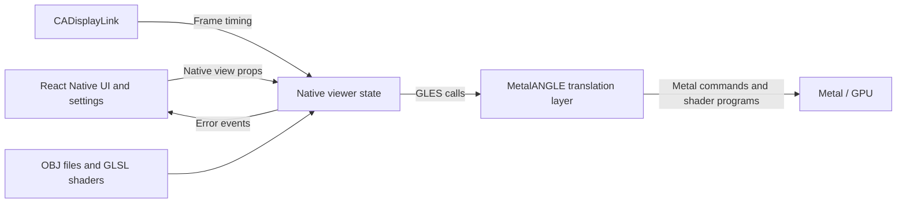

# React controls, GLES rendering, Metal execution

The goal is to keep an OpenGL ES renderer usable on a Metal backend while React Native supplies the interface. ANGLE implements the GLES API and translates its work to Metal. React sends changes to the native viewer; the viewer issues GLES calls; ANGLE executes that work through Metal on the GPU.



Calling ANGLE a GLES emulator can express compatibility, but **GLES-to-Metal translation layer** is more precise here. The viewer still uses the GLES programming model: buffers, shader programs, uniforms and draw calls. ANGLE implements that model with Metal resources and commands. This is GPU rendering; React does not execute Metal or translate shaders.

## Three independent responsibilities

| Layer | Owns | Changes at |
| --- | --- | --- |
| React Native | Buttons, search, selected model, color and animation settings | UI events and React commits |
| Native viewer | Mesh data, transforms, GPU resource handles, GLES calls, frame timing | Prop changes, asset loads and native frames |
| MetalANGLE / Metal | GLES implementation, backend resource/state translation, shader translation and GPU execution | GLES resource operations and draws |

ANGLE and React solve different problems. ANGLE adapts a graphics API to a GPU backend. React manages interface state and native UI updates. The native viewer connects them.

## Why changing headers and linking is only part of the migration

There are two interfaces in the old viewer:

1. **GLES rendering:** `glCreateShader`, `glBufferData`, `glUniform*`, `glDrawArrays`, and GLSL source. These calls now resolve to MetalANGLE instead of Apple OpenGLES. Their rendering logic stays intact.
2. **iOS hosting:** create a context, attach a drawable to a UIView, bind it, and present frames. The old code used Apple's `EAGLContext` and `GLKView`. ANGLE needs its own EGL context and drawable; this fork exposes those through `MGLContext`, `MGLKView` and `MGLLayer`.

Headers and linker settings change the GLES implementation. The hosting changes establish a drawable that that implementation can render into. An Apple EAGL context is not an ANGLE EGL context.

```text
Before: native viewer → Apple GLES → EAGLContext / GLKView
After:  native viewer → MetalANGLE GLES → EGL / MGLKit → Metal
```

The original author already had native graphics hosting through Rend and overlaid a transparent React root view. Our adaptation registers a native view with React Native. This is a separate integration choice from ANGLE: either embedding structure can use a GLES-to-Metal backend.

## Reading the longer init method

The old class inherited from GLKView, so `super initWithFrame:context:` already created the graphics view. The ANGLE version inherits from UIView and **owns an MGLKView child**. This fork's `MGLKView.h` explicitly says not to subclass MGLKView. Some setup that previously belonged to the superclass is now visible in our initializer.

| Initialization step | Why it exists | Required by the translation concept? |
| --- | --- | --- |
| Initialize the containing UIView | React Native needs a native view to mount | A host view is needed; this particular container follows MGLKView's restriction |
| Create MGLContext | Establish the ANGLE GLES context | Yes, an ANGLE-compatible context is needed |
| Request GLES 3 | Use the supplied ES3 branch/artifact | A branch choice; GLES-to-Metal translation itself does not require ES3 |
| Create and attach MGLKView | Provide the ANGLE drawable and presentation lifecycle | A drawable is needed; MGLKit is this fork's convenience wrapper |
| Set delegate and disable setNeedsDisplay rendering | Route drawing to our existing renderer under CADisplayLink | A frame-loop integration choice |
| Set autoresizing and disable child interaction | Fit the mounted React view and let it receive input | UIView integration details |
| Set 24-bit depth and 4× multisampling | Preserve the previous drawable configuration | Preserved viewer settings, not new scene behavior |
| Bind context after drawable configuration | Ensure GLES resource creation has a current context | Required before GLES operations; the ordering matters for this MGLKit implementation |
| Catch exceptions, check return values, log backend and reject non-Metal | Surface integration failures and verify this experiment uses Metal | Checks added for this experiment, not scene logic |
| Compile shaders, create VBOs, load cone.obj | Initialize the same viewer content | Existing renderer work |

The first context binding is an early validity check. The binding after drawable configuration is essential before querying GLES and creating resources. Those two checks can be consolidated in a later code cleanup; their presence does not mean the scene needs two contexts. There is one viewer context.

In this fork, drawable-format setters call `releaseSurface`. That code can unbind EGL, including when the context was current without a surface. Our first device attempt returned null GL strings after setup. Rebinding after the format setters fixed it. This is an observed MGLKit lifecycle detail, not a general requirement to rebind after every GLES call.

Before creating GPU resources, the final binding uses `forLayer:nil`: the context can create resources without a presentation surface. When drawing begins, MGLKView binds the context to its actual layer and handles presentation. React determines the view's eventual size; initialization starts with a zero-size container.

## What happens during one frame

1. CADisplayLink invokes the native viewer while the application is active.
2. Native code advances rotation and flight using elapsed time.
3. MGLKView binds its context and drawable, then invokes `mglkView:drawInRect:`.
4. The viewer clears, sets uniforms, binds its VBO and calls `glDrawArrays`.
5. MetalANGLE implements those GLES operations using Metal; MGLKView presents the resulting drawable.

The frame loop starts when the view enters a window, not inside init. React is involved when a setting changes, not on every animation frame. Shader compilation and mesh upload happen during initialization or model changes, not as routine work for every frame.

The viewer must use the drawable provided by the wrapper. It must not assume framebuffer zero or manually present a second time. Leaving the window stops its display link; backgrounding skips frames; teardown deletes its owned program and buffers with the appropriate context current.

## What the working experiment establishes

The iPhone reported `ANGLE (Metal Renderer: Apple A15 GPU)` and `OpenGL ES 3.0.0 (ANGLE 2.1.0.ec925142edeb)`. The first frame had no GLES error. All ten models loaded during interaction, and the user confirmed rendering and controls. This demonstrates the current native viewer running through the supplied Metal backend.

It does not measure speed relative to Apple GLES or validate every ES3 feature. The handoff states that the fork advertises ES3 but has maximum conformant ES2. Our retained shaders and drawing use the existing ES2-compatible path in an ES3 context.

## How this supports the future painter idea

Keep the same division: React manages tools, layer selection and document controls; a native renderer owns stroke preview, textures and compositing; ANGLE translates that renderer's GLES work to Metal. Changing a mesh renderer into a painter requires new rendering logic, but it does not require React to run the frame loop or a rewrite of every GLES call into Metal.

A custom React reconciler could later translate a Layer/Stroke scene tree into native create/update/remove operations. ANGLE would still sit below that native renderer. It does not supply the scene graph, brush engine, undo model or React reconciler. Establish the native scene/document interface before adding that extra layer; see [the painter concepts](RENDERER-IDEAS.md).

For build commands, artifact details and verification, see [ANGLE integration](ANGLE.md). For the original/current source map, see [architecture](ARCHITECTURE.md).
